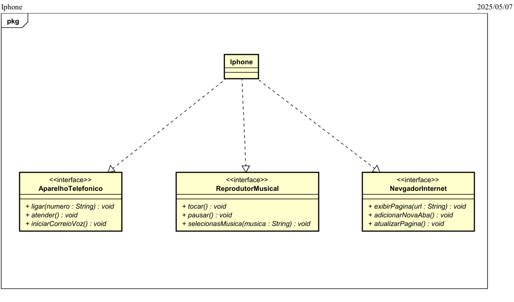

# 📱 Desafio POO - iPhone

Este repositório contém a solução do desafio de Programação Orientada a Objetos (POO), proposto na plataforma [DIO](https://github.com/digitalinnovationone/trilha-java-basico/tree/main/desafios/poo), com base no vídeo de lançamento do iPhone (2007), apresentado por Steve Jobs.

## 🎯 Objetivo

Modelar, diagramar e opcionalmente implementar em Java o componente `iPhone`, que simula as seguintes funcionalidades:

- 🎵 Reprodutor Musical
- 📞 Aparelho Telefônico
- 🌐 Navegador na Internet

---

## 📌 Funcionalidades Modeladas

### Interface `ReprodutorMusical`
- `tocar()`
- `pausar()`
- `selecionarMusica(String musica)`

### Interface `AparelhoTelefonico`
- `ligar(String numero)`
- `atender()`
- `iniciarCorreioVoz()`

### Interface `NavegadorInternet`
- `exibirPagina(String url)`
- `adicionarNovaAba()`
- `atualizarPagina()`

---

## 🧩 Diagrama UML

O diagrama de classes abaixo mostra a modelagem do componente `iPhone`, que implementa as três interfaces mencionadas:

📎 Arquivo disponível em: [`/imagem/Iphone-1.png`](./imagem/Iphone-1.png)

---

## 👨‍🏫 Autor do Desafio

**Gleyson Sampaio**  
Plataforma: [DIO - Digital Innovation One](https://www.dio.me/)

